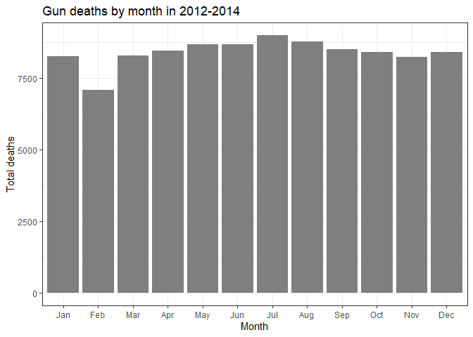
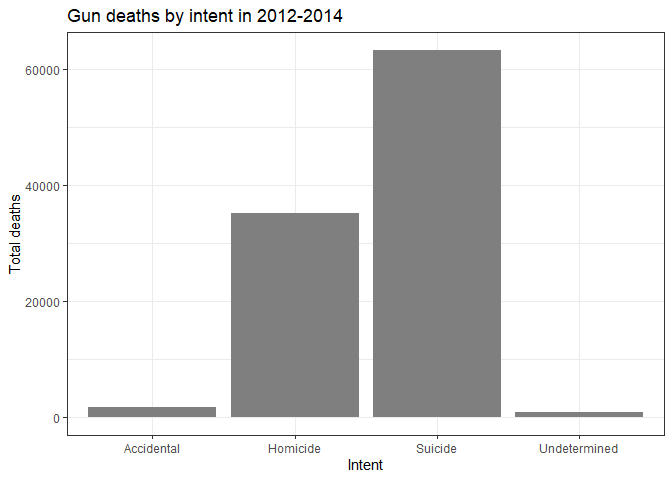
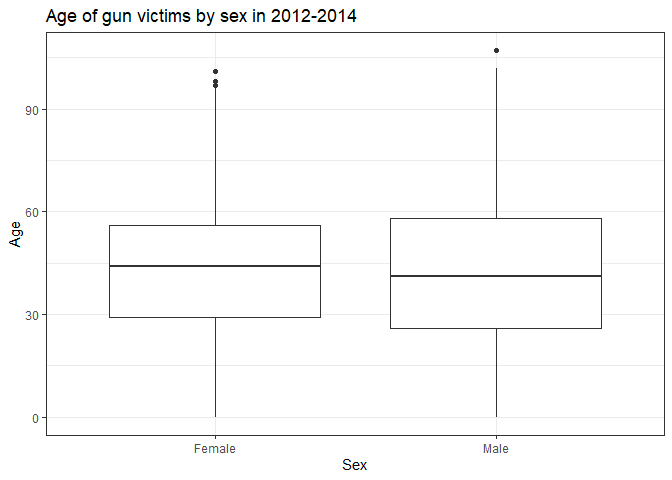

Exploring Gun Deaths in America
================
Daniel Krochmal

## Objectives

  - To explore gun death data curated by FiveThirtyEight [original data
    available here](https://github.com/fivethirtyeight/guns-data) by
      - Month
      - Intent
      - Age and sex
      - Education
      - Season
      - Intent by race
      - Police-relatedness

## Read in the data

The gun\_deaths.csv is provided in the repository.

``` r
library(tidyverse)    # load tidyverse packages, including ggplot2
library(knitr)
library(readr)

# read in the data
gun_deaths <- read_csv("gun_deaths.csv")
```

## Generating a data frame that summarizes the number of gun deaths per month and printing using `kable()`.

Knitr is part of the knitr package. Allows you to change column names
and add captions and make pretty tables in your knitted document. Hint:
set the argument format = “markdown”

``` r
gun_deaths_monthly <- gun_deaths %>%
    transmute(month = factor(month.abb[month], levels = c("Jan", "Feb", "Mar", "Apr", "May", "Jun", "Jul", "Aug", "Sep", "Oct", "Nov", "Dec"))) %>%
    group_by(month) %>%
    count()

kable(
    gun_deaths_monthly,
    format = "markdown",
    col.names = c("Month", "Total deaths")
)
```

| Month | Total deaths |
| :---- | -----------: |
| Jan   |         8273 |
| Feb   |         7093 |
| Mar   |         8289 |
| Apr   |         8455 |
| May   |         8669 |
| Jun   |         8677 |
| Jul   |         8989 |
| Aug   |         8783 |
| Sep   |         8508 |
| Oct   |         8406 |
| Nov   |         8243 |
| Dec   |         8413 |

### Generating a bar chart with human-readable labels on the x-axis. That is, each month should be labeled “Jan”, “Feb”, “Mar” (full or abbreviated month names are fine), not `1`, `2`, `3`.

``` r
ggplot(gun_deaths_monthly, aes(x = month, y = n)) +
    geom_col(
        fill = "grey50"
    ) +
    
    labs(
        title = "Gun deaths by month in 2012-2014",
        x = "Month",
        y = "Total deaths"
    ) + 
    
    theme_bw()
```

<!-- -->

## Generating a bar chart that identifies the number of gun deaths associated with each type of intent cause of death. The bars should be sorted from highest to lowest values.

``` r
gun_deaths %>%
    filter(intent != "Not Available") %>%
    group_by(intent) %>%
    count() %>%

    ggplot(aes(x = intent, y = n)) +
    geom_col(fill = "grey50") +
    
    labs(
        x = "Intent",
        y = "Total deaths",
        title = "Gun deaths by intent in 2012-2014"
    ) +
    
    theme_bw()
```

<!-- -->

## Generating a boxplot visualizing the age of gun death victims, by sex. Print the average age of female gun death victims.

``` r
gun_deaths_sex_age <- gun_deaths %>%
    filter(age != "Not Available" & sex != "Not Available") %>%
    transmute(sex, age = as.numeric(age)) %>%
    group_by(sex)

    ggplot(gun_deaths_sex_age, aes(x = sex, y = age)) +
    geom_boxplot() +
        
    labs(
        x = "Sex",
        y = "Age",
        title = "Age of gun victims by sex in 2012-2014"
    ) +
    
    scale_x_discrete(labels = c("Female", "Male")) +   
    
    theme_bw()
```

<!-- -->

``` r
kable(
    format = "markdown",
    gun_deaths_sex_age %>%
        filter(sex == "F") %>%
        summarize(mean(age)),
    col.names = c("Sex", "Average age")
)
```

    ## `summarise()` ungrouping output (override with `.groups` argument)

| Sex | Average age |
| :-- | ----------: |
| F   |    43.69507 |

## How many white males with at least a high school education were killed by guns in 2012?

``` r
kable(
    format = "markdown",
    gun_deaths %>%
        filter(education != "Less than HS", year == 2012, race == "White", sex == "M") %>%
        count(),
    col.names = ("Number of white males with high school or higher killed by guns in 2012")
)
```

| Number of white males with high school or higher killed by guns in 2012 |
| ----------------------------------------------------------------------: |
|                                                                   15484 |

## Which season of the year has the most gun deaths?

Assume that:

  - Winter = January-March
  - Spring = April-June
  - Summer = July-September
  - Fall = October-December

<!-- end list -->

``` r
deaths_by_season <- gun_deaths %>%
    mutate(season = 
                ifelse(month == 1 | month == 2 | month == 3, "Winter",
                ifelse(month == 4 | month == 5 | month == 6, "Spring",
                ifelse(month == 7 | month == 8 | month == 9, "Summer",
                ifelse(month == 10 | month == 11 | month == 12, "Fall", NA))))) %>%
    group_by(season) %>%
    count() %>%
    arrange(desc(n))

kable(
    format = "markdown",
    deaths_by_season,
    col.names = c("Season", "Number of deaths")
)
```

| Season | Number of deaths |
| :----- | ---------------: |
| Summer |            26280 |
| Spring |            25801 |
| Fall   |            25062 |
| Winter |            23655 |

# These are more open ended questions from here on out, you could look at making multiple summaries or types of plots.

### Are whites who are killed by guns more likely to die because of suicide or homicide? How does this compare to blacks and hispanics?

\*\*

``` r
deaths_by_race <- gun_deaths %>%
    select(race, intent) %>%
    filter(intent %in% c("Homicide", "Suicide"),
           race %in% c("White", "Hispanic", "Black")) %>%
    group_by(race, intent) %>%
    count()

kable(
    format = "markdown",
    deaths_by_race,
    col.names = c("Race", "Intent", "Number of deaths")
)
```

| Race     | Intent   | Number of deaths |
| :------- | :------- | ---------------: |
| Black    | Homicide |            19510 |
| Black    | Suicide  |             3332 |
| Hispanic | Homicide |             5634 |
| Hispanic | Suicide  |             3171 |
| White    | Homicide |             9147 |
| White    | Suicide  |            55372 |

(hint maybe looking at percentages would be good)

### Are police-involved gun deaths significantly different from other gun deaths? Assess the relationship between police involvement and age, police involvement and race, and the intersection of all three variables.

Think about performing stats such as a t.test to see if differences you
are plotting are statistically significant

Finally, all together now:

## Session info

``` r
# always good to have this for reproducibility purposes
devtools::session_info()
```

    ## - Session info ---------------------------------------------------------------
    ##  setting  value                       
    ##  version  R version 4.0.2 (2020-06-22)
    ##  os       Windows 10 x64              
    ##  system   x86_64, mingw32             
    ##  ui       RTerm                       
    ##  language (EN)                        
    ##  collate  English_United States.1252  
    ##  ctype    English_United States.1252  
    ##  tz       America/Chicago             
    ##  date     2020-07-28                  
    ## 
    ## - Packages -------------------------------------------------------------------
    ##  package     * version date       lib source        
    ##  assertthat    0.2.1   2019-03-21 [1] CRAN (R 4.0.2)
    ##  backports     1.1.7   2020-05-13 [1] CRAN (R 4.0.0)
    ##  blob          1.2.1   2020-01-20 [1] CRAN (R 4.0.2)
    ##  broom         0.7.0   2020-07-09 [1] CRAN (R 4.0.2)
    ##  callr         3.4.3   2020-03-28 [1] CRAN (R 4.0.2)
    ##  cellranger    1.1.0   2016-07-27 [1] CRAN (R 4.0.2)
    ##  cli           2.0.2   2020-02-28 [1] CRAN (R 4.0.2)
    ##  colorspace    1.4-1   2019-03-18 [1] CRAN (R 4.0.2)
    ##  crayon        1.3.4   2017-09-16 [1] CRAN (R 4.0.2)
    ##  DBI           1.1.0   2019-12-15 [1] CRAN (R 4.0.2)
    ##  dbplyr        1.4.4   2020-05-27 [1] CRAN (R 4.0.2)
    ##  desc          1.2.0   2018-05-01 [1] CRAN (R 4.0.2)
    ##  devtools      2.3.1   2020-07-21 [1] CRAN (R 4.0.2)
    ##  digest        0.6.25  2020-02-23 [1] CRAN (R 4.0.2)
    ##  dplyr       * 1.0.0   2020-05-29 [1] CRAN (R 4.0.2)
    ##  ellipsis      0.3.1   2020-05-15 [1] CRAN (R 4.0.2)
    ##  evaluate      0.14    2019-05-28 [1] CRAN (R 4.0.2)
    ##  fansi         0.4.1   2020-01-08 [1] CRAN (R 4.0.2)
    ##  farver        2.0.3   2020-01-16 [1] CRAN (R 4.0.2)
    ##  forcats     * 0.5.0   2020-03-01 [1] CRAN (R 4.0.2)
    ##  fs            1.4.2   2020-06-30 [1] CRAN (R 4.0.2)
    ##  generics      0.0.2   2018-11-29 [1] CRAN (R 4.0.2)
    ##  ggplot2     * 3.3.2   2020-06-19 [1] CRAN (R 4.0.2)
    ##  glue          1.4.1   2020-05-13 [1] CRAN (R 4.0.2)
    ##  gtable        0.3.0   2019-03-25 [1] CRAN (R 4.0.2)
    ##  haven         2.3.1   2020-06-01 [1] CRAN (R 4.0.2)
    ##  highr         0.8     2019-03-20 [1] CRAN (R 4.0.2)
    ##  hms           0.5.3   2020-01-08 [1] CRAN (R 4.0.2)
    ##  htmltools     0.5.0   2020-06-16 [1] CRAN (R 4.0.2)
    ##  httr          1.4.1   2019-08-05 [1] CRAN (R 4.0.0)
    ##  jsonlite      1.7.0   2020-06-25 [1] CRAN (R 4.0.2)
    ##  knitr       * 1.29    2020-06-23 [1] CRAN (R 4.0.2)
    ##  labeling      0.3     2014-08-23 [1] CRAN (R 4.0.0)
    ##  lifecycle     0.2.0   2020-03-06 [1] CRAN (R 4.0.2)
    ##  lubridate     1.7.9   2020-06-08 [1] CRAN (R 4.0.2)
    ##  magrittr      1.5     2014-11-22 [1] CRAN (R 4.0.2)
    ##  memoise       1.1.0   2017-04-21 [1] CRAN (R 4.0.2)
    ##  modelr        0.1.8   2020-05-19 [1] CRAN (R 4.0.2)
    ##  munsell       0.5.0   2018-06-12 [1] CRAN (R 4.0.2)
    ##  pillar        1.4.6   2020-07-10 [1] CRAN (R 4.0.2)
    ##  pkgbuild      1.1.0   2020-07-13 [1] CRAN (R 4.0.2)
    ##  pkgconfig     2.0.3   2019-09-22 [1] CRAN (R 4.0.2)
    ##  pkgload       1.1.0   2020-05-29 [1] CRAN (R 4.0.2)
    ##  prettyunits   1.1.1   2020-01-24 [1] CRAN (R 4.0.2)
    ##  processx      3.4.3   2020-07-05 [1] CRAN (R 4.0.2)
    ##  ps            1.3.3   2020-05-08 [1] CRAN (R 4.0.2)
    ##  purrr       * 0.3.4   2020-04-17 [1] CRAN (R 4.0.2)
    ##  R6            2.4.1   2019-11-12 [1] CRAN (R 4.0.2)
    ##  Rcpp          1.0.4.6 2020-04-09 [1] CRAN (R 4.0.2)
    ##  readr       * 1.3.1   2018-12-21 [1] CRAN (R 4.0.2)
    ##  readxl        1.3.1   2019-03-13 [1] CRAN (R 4.0.2)
    ##  remotes       2.2.0   2020-07-21 [1] CRAN (R 4.0.2)
    ##  reprex        0.3.0   2019-05-16 [1] CRAN (R 4.0.2)
    ##  rlang         0.4.6   2020-05-02 [1] CRAN (R 4.0.2)
    ##  rmarkdown     2.3     2020-06-18 [1] CRAN (R 4.0.2)
    ##  rprojroot     1.3-2   2018-01-03 [1] CRAN (R 4.0.2)
    ##  rstudioapi    0.11    2020-02-07 [1] CRAN (R 4.0.2)
    ##  rvest         0.3.5   2019-11-08 [1] CRAN (R 4.0.0)
    ##  scales        1.1.1   2020-05-11 [1] CRAN (R 4.0.2)
    ##  sessioninfo   1.1.1   2018-11-05 [1] CRAN (R 4.0.2)
    ##  stringi       1.4.6   2020-02-17 [1] CRAN (R 4.0.0)
    ##  stringr     * 1.4.0   2019-02-10 [1] CRAN (R 4.0.2)
    ##  testthat      2.3.2   2020-03-02 [1] CRAN (R 4.0.2)
    ##  tibble      * 3.0.2   2020-07-07 [1] CRAN (R 4.0.2)
    ##  tidyr       * 1.1.0   2020-05-20 [1] CRAN (R 4.0.2)
    ##  tidyselect    1.1.0   2020-05-11 [1] CRAN (R 4.0.2)
    ##  tidyverse   * 1.3.0   2019-11-21 [1] CRAN (R 4.0.2)
    ##  usethis       1.6.1   2020-04-29 [1] CRAN (R 4.0.2)
    ##  vctrs         0.3.1   2020-06-05 [1] CRAN (R 4.0.2)
    ##  withr         2.2.0   2020-04-20 [1] CRAN (R 4.0.2)
    ##  xfun          0.15    2020-06-21 [1] CRAN (R 4.0.2)
    ##  xml2          1.3.2   2020-04-23 [1] CRAN (R 4.0.2)
    ##  yaml          2.2.1   2020-02-01 [1] CRAN (R 4.0.0)
    ## 
    ## [1] C:/Users/dankr/Documents/R/win-library/4.0
    ## [2] C:/Program Files/R/R-4.0.2/library
